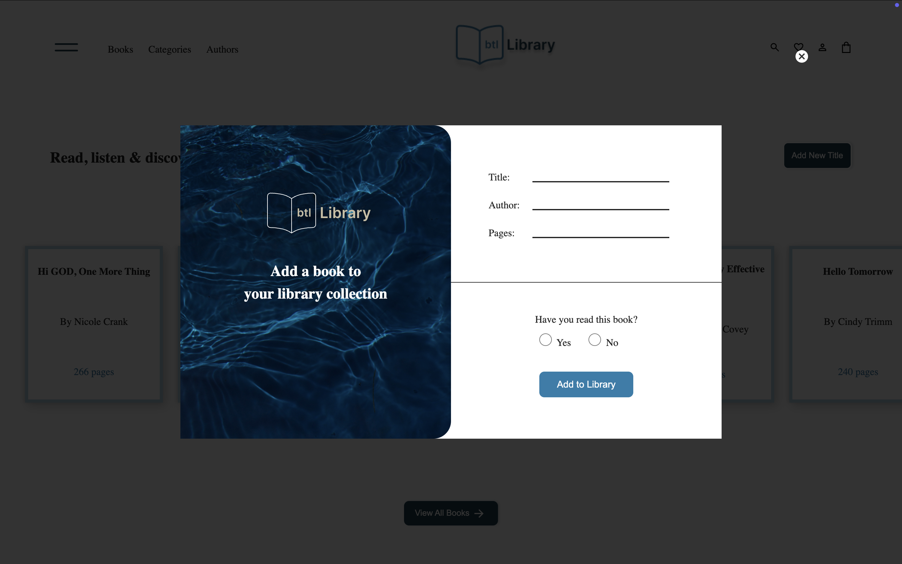
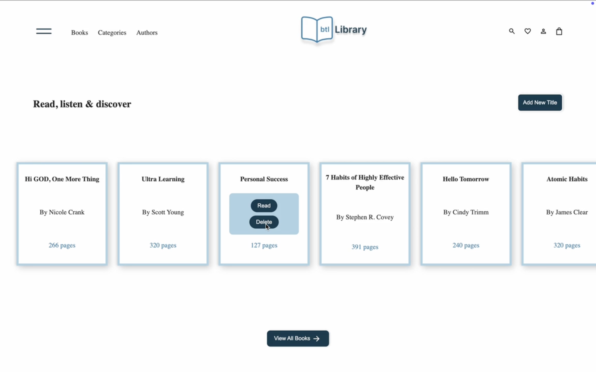
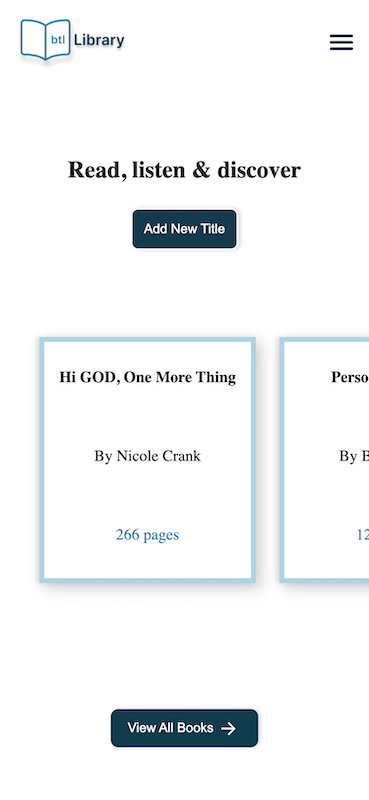
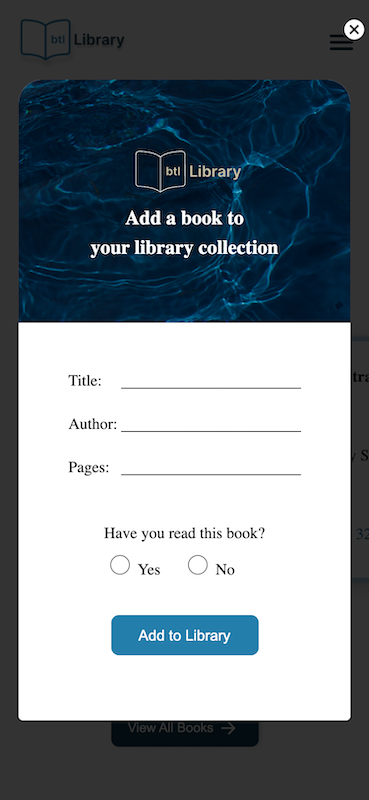

# Library Project

This is a mini library app testing Javascript concepts on objects and object constructors.

## Screenshots

## Live View
[Live Preview](https://top-library-project.vercel.app)
